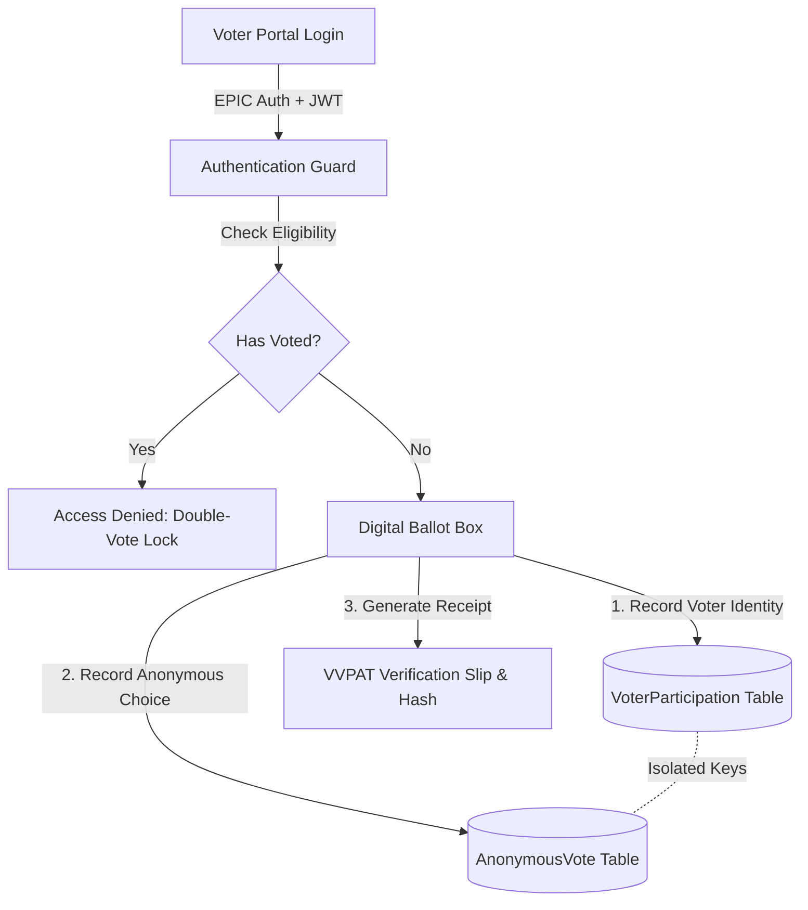

# 🗳️ Bharat Matdan Manch — India Digital Election Platform

[](https://nextjs.org/)
[](https://www.typescriptlang.org/)
[](https://www.prisma.io/)
[](https://tailwindcss.com/)
[](https://www.docker.com/)
[](LICENSE)

An **end-to-end verifiable, secure, modern full-stack web application** architected for Indian election workflows (State → District → Constituency → Polling Station → Booth hierarchy) across 543 Parliamentary Constituencies.

---

## 🌟 Key Features & Engineering Highlights

- 🔐 **Secret Ballot Isolation Protocol**: Voter authentication metadata (`VoterParticipation`) is cryptographically segregated from anonymous vote choices (`AnonymousVote`) to preserve secret ballot privacy.
- 🚫 **Double-Vote Prevention Lock**: Database-level unique constraint locks on `(voterId, electionId)` prevent multi-submission and replay attacks.
- 🖨️ **Interactive VVPAT Slip Simulator**: 7-second slip preview modal with animation, sound feedback, and instant cryptographic hash receipt generation.
- 🗺️ **Interactive Live Results & India Map**: SVG Map with state-wise & constituency-wise vote tallies, turnout percentages, and party leaderboards.
- 🛡️ **Role-Based Access Control (RBAC)**: Distinct access workflows for Voters, Polling Officers, and Super Admins.
- 🌐 **Multilingual Support (EN / HI)**: Full i18n support with instant language switching between English and Hindi.

---

## 🏗️ System Architecture & Data Isolation Flow



---

## 🔑 Recruiter Quick Demo Access Profiles

| Role | Identifier / EPIC | Password | Access Details |
| :--- | :--- | :--- | :--- |
| 🗳️ **Registered Voter 1** | `EPIC100001` | `Voter123!` | Mumbai South Constituency |
| 🗳️ **Registered Voter 2** | `EPIC100003` | `Voter123!` | Varanasi Constituency |
| 👮 **Polling Officer** | `officer.mumbai@eci.gov.in` | `Pass123!` | Booth #1 Station Check-in Terminal |
| 👑 **Super Admin** | `admin@eci.gov.in` | `Pass123!` | Election Lifecycle, Candidate Registry & Audit Logs |

---

## 🚀 Getting Started (Local Development)

### Prerequisites
- Node.js `v18+`
- npm or yarn

### 1. Clone & Install Dependencies

```bash
git clone https://github.com/iamrazzz77/bharat-matdan-manch.git
cd bharat-matdan-manch
npm install
```

### 2. Database Migration & Realistic Indian Data Seeding

```bash
# Push Prisma schema to SQLite / PostgreSQL
npx prisma db push

# Seed 543 Constituencies, Sample Voters, Candidates & Polling Officers
npx prisma db seed
```

### 3. Launch Development Server

```bash
npm run dev
```

Visit **[http://localhost:3000](http://localhost:3000)** in your browser.

---

## 🧪 Testing Suite

Run unit tests for cryptographic receipts, double-vote lock validation, and API contracts:

```bash
npm test
```

---

## 🐳 Running with Docker

Run full-stack containerized environment using PostgreSQL:

```bash
docker-compose up --build
```

---

## 📄 License

Distributed under the MIT License. Built for educational and portfolio demonstration purposes.
